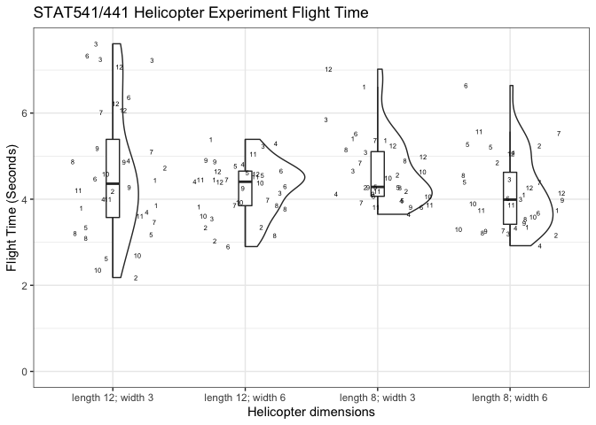
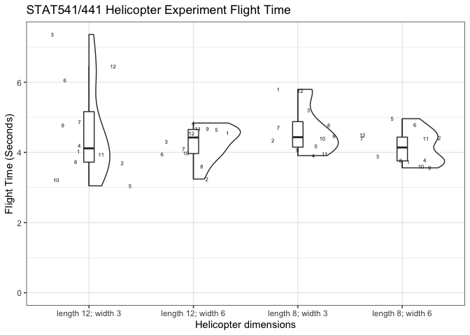

Helicopter Analysis
================

## Data Processing

Read and process data:

``` r
d1 <- read_csv('braun_copters.csv') %>% mutate(id = 1)
d2 <- read_csv('data.csv') %>% mutate(id = 2)
d3 <- read_csv('Data.csv') %>% select(EU, trt, OU, time) %>% mutate(id = 3)
d4 <- read_csv('EU_data1.csv') %>% select(EU, trt, OU, time) %>% mutate(id =4)
d5 <- read_csv('harleyhelicopterdata.csv') %>% mutate(id =5)
d6 <- read_csv('Helicopter.csv')%>% select(EU, trt, OU, time) %>% mutate(id =6)
d7 <- read_csv('HelicopterLab10.csv') %>% rename(time = `time(seconds)`) %>% mutate(id =7)
d8 <- read_csv('helicopters.csv')%>% select(EU, trt, OU, time) %>% mutate(id =8)
d9 <- read_csv('helidata.csv')%>% select(EU, trt, OU, time) %>% mutate(id =9)
d10 <- read_csv('james_wilson.csv')%>% select(EU, trt, OU, time) %>% mutate(id =10)
d11 <- read_csv('lab10_data.csv')%>% select(EU, trt, OU, time) %>% mutate(id =11)
d12 <- read_csv('STAT541 Lab 10.csv')%>% select(EU, trt, OU, time) %>% mutate(id =12)
```

``` r
comb_data <- bind_rows(d1,d2,d3,d4,d5,d6,d7,d8,d9,d10,d11,d12)
```

## Data Visualization

``` r
comb_data %>% ggplot(aes(x = trt, y = time, label = id)) + 
  geom_violinhalf() + 
  geom_boxplot(width=0.1, outlier.shape = NA) + 
  geom_text(position = position_jitter(seed = 1), size = 2) + 
  theme_bw() + 
  ylab('Flight Time (Seconds)') + 
  xlab('Helicopter dimensions') + 
  ggtitle('STAT541/441 Helicopter Experiment Flight Time') + 
  ylim(0, NA)
```

<!-- -->

``` r
comb_data %>% group_by(id, EU, trt) %>% 
  summarize(time = mean(time), .groups = 'drop') %>%
   ggplot(aes(x = trt, y = time, label = id)) + 
  geom_violinhalf() + 
  geom_boxplot(width=0.1, outlier.shape = NA) + 
  geom_text(position = position_jitter(seed = 1), size = 2) + 
  theme_bw() + 
  ylab('Flight Time (Seconds)') + 
  xlab('Helicopter dimensions') + 
  ggtitle('STAT541/441 Helicopter Experiment Flight Time') + 
  ylim(0, NA)
```

<!-- -->

## Data Analysis

### Average of OUs

The first option for analyzing the data is to summarize the OUs, while
treating the id as random blocks.

``` r
model1 <- comb_data %>% group_by(id, EU, trt) %>% 
  summarize(time = mean(time), .groups = 'drop') %>%
  stan_glmer(time ~ trt  -1 + (1 |id), data = .);
model1
```

    ## stan_glmer
    ##  family:       gaussian [identity]
    ##  formula:      time ~ trt - 1 + (1 | id)
    ##  observations: 48
    ## ------
    ##                       Median MAD_SD
    ## trtlength 12; width 3 4.6    0.2   
    ## trtlength 12; width 6 4.2    0.2   
    ## trtlength 8; width 3  4.6    0.2   
    ## trtlength 8; width 6  4.1    0.2   
    ## 
    ## Auxiliary parameter(s):
    ##       Median MAD_SD
    ## sigma 0.8    0.1   
    ## 
    ## Error terms:
    ##  Groups   Name        Std.Dev.
    ##  id       (Intercept) 0.33    
    ##  Residual             0.79    
    ## Num. levels: id 12 
    ## 
    ## ------
    ## * For help interpreting the printed output see ?print.stanreg
    ## * For info on the priors used see ?prior_summary.stanreg

``` r
round(posterior_interval(model1, prob = .95, regex_pars = 'trt'),2)
```

    ##                       2.5% 97.5%
    ## trtlength 12; width 3 4.13  5.08
    ## trtlength 12; width 6 3.77  4.72
    ## trtlength 8; width 3  4.12  5.09
    ## trtlength 8; width 6  3.66  4.61

Based on this analysis, we see that, on average, helicopters with wing
length of 12 cm (or 8 cm) and width of 3 cm tend to fly about 4.1 - 5.1
seconds when dropped off of the Wilson bridge. Helicopters with wing
length of 12 cm and width of 6 cm tend to fly for between 3.7 and 4.7
seconds, and wing length of 8 cm and width of 7 cm tend to fly for
between 3.6 and 4.6 seconds.

If half a second represents a meaningful difference in flight time,
given the uncertainty in the estimates above, we’d recommend additional
experimentation and replication to ascertain whether differences of this
magnitude can be replicated.
